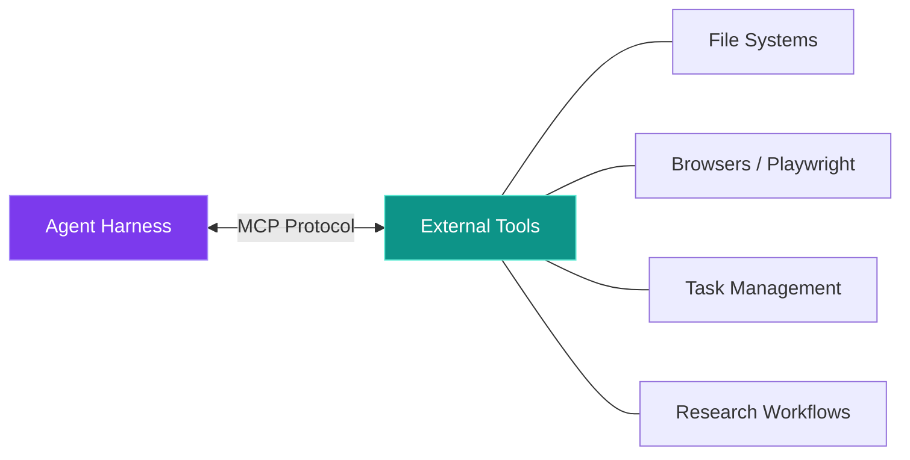
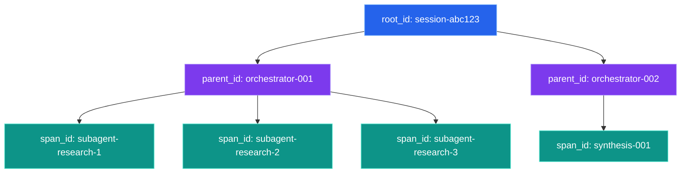

# SPINE Architecture Overview

SPINE is a context engineering and multi-agent backbone framework built for long-running, complex software development workflows. It handles instrumentation, multi-provider LLM access, and orchestration patterns that tie agentic projects together.

The goal: coordinated multi-agent development with full traceability, cost tracking, and reproducible context stacks.

---

## Three Capability Layers

SPINE works across three layers:

| Layer | What | Why |
|-------|------|-----|
| **1. Host Agent** | Built-in subagent types (Explore, Plan, code-architect, visual-tester) | Parallel agents without MCP overhead |
| **2. MCP Servers** | browser-mcp, next-conductor, research-agent-mcp, smart-inventory | External tool integration |
| **3. SPINE Python** | fan_out(), pipeline(), ToolEnvelope, TraceScope | Custom instrumented orchestration |

<div style="font-family: 'Inter', system-ui, sans-serif; max-width: 720px; margin: 1.5em auto;">

  <div style="background: linear-gradient(135deg, #7c3aed 0%, #6d28d9 100%); border-radius: 12px; padding: 20px 24px; margin-bottom: 6px; box-shadow: 0 4px 20px rgba(124,58,237,0.3);">
    <div style="color: #e9d5ff; font-size: 11px; text-transform: uppercase; letter-spacing: 2px; margin-bottom: 8px;">Layer 1</div>
    <div style="color: #fff; font-size: 18px; font-weight: 700; margin-bottom: 12px;">Host Agent</div>
    <div style="display: flex; flex-wrap: wrap; gap: 8px;">
      <span style="background: rgba(255,255,255,0.15); border: 1px solid rgba(255,255,255,0.25); border-radius: 20px; padding: 5px 14px; color: #f5f3ff; font-size: 13px;">Explore</span>
      <span style="background: rgba(255,255,255,0.15); border: 1px solid rgba(255,255,255,0.25); border-radius: 20px; padding: 5px 14px; color: #f5f3ff; font-size: 13px;">Plan</span>
      <span style="background: rgba(255,255,255,0.15); border: 1px solid rgba(255,255,255,0.25); border-radius: 20px; padding: 5px 14px; color: #f5f3ff; font-size: 13px;">code-architect</span>
      <span style="background: rgba(255,255,255,0.15); border: 1px solid rgba(255,255,255,0.25); border-radius: 20px; padding: 5px 14px; color: #f5f3ff; font-size: 13px;">visual-tester</span>
      <span style="background: rgba(255,255,255,0.15); border: 1px solid rgba(255,255,255,0.25); border-radius: 20px; padding: 5px 14px; color: #f5f3ff; font-size: 13px;">research-coordinator</span>
      <span style="background: rgba(255,255,255,0.15); border: 1px solid rgba(255,255,255,0.25); border-radius: 20px; padding: 5px 14px; color: #f5f3ff; font-size: 13px;">context-engineer</span>
    </div>
  </div>

  <div style="text-align: center; color: #94a3b8; font-size: 22px; line-height: 1;">&#9661;</div>

  <div style="background: linear-gradient(135deg, #0d9488 0%, #0f766e 100%); border-radius: 12px; padding: 20px 24px; margin-bottom: 6px; box-shadow: 0 4px 20px rgba(13,148,136,0.3);">
    <div style="color: #99f6e4; font-size: 11px; text-transform: uppercase; letter-spacing: 2px; margin-bottom: 8px;">Layer 2</div>
    <div style="color: #fff; font-size: 18px; font-weight: 700; margin-bottom: 12px;">MCP Servers</div>
    <div style="display: flex; flex-wrap: wrap; gap: 8px;">
      <span style="background: rgba(255,255,255,0.15); border: 1px solid rgba(255,255,255,0.25); border-radius: 20px; padding: 5px 14px; color: #f0fdfa; font-size: 13px;">browser-mcp</span>
      <span style="background: rgba(255,255,255,0.15); border: 1px solid rgba(255,255,255,0.25); border-radius: 20px; padding: 5px 14px; color: #f0fdfa; font-size: 13px;">next-conductor</span>
      <span style="background: rgba(255,255,255,0.15); border: 1px solid rgba(255,255,255,0.25); border-radius: 20px; padding: 5px 14px; color: #f0fdfa; font-size: 13px;">research-agent-mcp</span>
      <span style="background: rgba(255,255,255,0.15); border: 1px solid rgba(255,255,255,0.25); border-radius: 20px; padding: 5px 14px; color: #f0fdfa; font-size: 13px;">smart-inventory</span>
      <span style="background: rgba(255,255,255,0.15); border: 1px solid rgba(255,255,255,0.25); border-radius: 20px; padding: 5px 14px; color: #f0fdfa; font-size: 13px;">minna-memory</span>
    </div>
  </div>

  <div style="text-align: center; color: #94a3b8; font-size: 22px; line-height: 1;">&#9661;</div>

  <div style="background: linear-gradient(135deg, #2563eb 0%, #1d4ed8 100%); border-radius: 12px; padding: 20px 24px; box-shadow: 0 4px 20px rgba(37,99,235,0.3);">
    <div style="color: #bfdbfe; font-size: 11px; text-transform: uppercase; letter-spacing: 2px; margin-bottom: 8px;">Layer 3</div>
    <div style="color: #fff; font-size: 18px; font-weight: 700; margin-bottom: 12px;">SPINE Python</div>
    <div style="display: flex; flex-wrap: wrap; gap: 8px;">
      <span style="background: rgba(255,255,255,0.15); border: 1px solid rgba(255,255,255,0.25); border-radius: 20px; padding: 5px 14px; color: #eff6ff; font-size: 13px;">run_scenario.py</span>
      <span style="background: rgba(255,255,255,0.15); border: 1px solid rgba(255,255,255,0.25); border-radius: 20px; padding: 5px 14px; color: #eff6ff; font-size: 13px;">fan_out()</span>
      <span style="background: rgba(255,255,255,0.15); border: 1px solid rgba(255,255,255,0.25); border-radius: 20px; padding: 5px 14px; color: #eff6ff; font-size: 13px;">pipeline()</span>
      <span style="background: rgba(255,255,255,0.15); border: 1px solid rgba(255,255,255,0.25); border-radius: 20px; padding: 5px 14px; color: #eff6ff; font-size: 13px;">ToolEnvelope</span>
      <span style="background: rgba(255,255,255,0.15); border: 1px solid rgba(255,255,255,0.25); border-radius: 20px; padding: 5px 14px; color: #eff6ff; font-size: 13px;">TraceScope</span>
    </div>
  </div>

</div>

---

## Layer 1: Host Agent Subagents

These are available via `Task(subagent_type="...")`:

| Subagent | Tier | What it does |
|----------|------|--------------|
| `Explore` | Fast | Codebase exploration, file discovery |
| `Plan` | Standard | Architecture planning, implementation design |
| `research-coordinator` | Flagship | Multi-source research with synthesis |
| `code-architect` | Standard | System design, architectural decisions |
| `visual-tester` | Fast | UI verification via browser automation |
| `context-engineer` | Standard | Context stack design and optimization |
| `general-purpose` | Default | Complex multi-step tasks |

> **Tier mapping is configurable:** Flagship = Opus/GPT-5.1/Gemini Pro, Standard = Sonnet/GPT-5.1-mini/Gemini Flash, Fast = Haiku/GPT-5-nano/Gemini Flash.

Works with any compatible agent harness (e.g., Claude Code, custom CLI). Subagents can access conversation context and run in parallel.

---

## Layer 2: MCP Servers

| Server | Tools | What for |
|--------|-------|----------|
| `browser-mcp` | navigate, screenshot, click, type | Visual UI testing |
| `next-conductor` | read_next, update_next, init_next | Task tracking |
| `research-agent-mcp` | clarify, search, evaluate, synthesize | Research workflows |
| `research-notes-mcp` | parse, cluster, contradictions | Note processing |
| `research-log-mcp` | create, log, cite | Citation management |
| `smart-inventory` | analyze_project | CLAUDE.md generation |
| `minna-memory` | store, recall, search, who | Persistent cross-session memory |



---

## Layer 3: SPINE Python

| Component | What it does |
|-----------|--------------|
| `run_scenario.py` | Execute reproducible context stack scenarios |
| `fan_out()` | Parallel subagent execution with aggregation |
| `pipeline()` | Sequential multi-step processing |
| `ToolEnvelope` | Instrumented LLM calls with trace correlation |
| `TraceScope` | Hierarchical context management |
| `LogAggregator` | Query and analyze execution logs |

### Directory Layout

```
spine/
├── _protocols/               # Usage protocols - read first
│   └── tiered-spine-usage.md
├── _templates/               # Templates for other projects
├── .claude/agents/           # Subagent definitions
├── KB/                       # Knowledge base
├── spine/                    # Core Python package
│   ├── core/                 # ToolEnvelope, TraceScope
│   ├── logging/              # Structured JSON logging
│   ├── client/               # Provider configs
│   └── patterns/             # fan_out, pipeline
├── tools/                    # Applications built on SPINE
├── scripts/                  # Scripts and tests
├── scenarios/                # Scenario configs (.yaml)
├── logs/                     # Structured logs
└── run_scenario.py           # Main entry point
```

---

## Context Stacks

SPINE uses hierarchical context stacks for consistent LLM interactions.

<div style="font-family: 'Inter', system-ui, sans-serif; max-width: 400px; margin: 1.5em auto; border-radius: 14px; overflow: hidden; box-shadow: 0 8px 30px rgba(0,0,0,0.15);">
  <div style="background: #1e293b; padding: 14px 20px; text-align: center; font-weight: 700; color: #e2e8f0; font-size: 14px; letter-spacing: 1px;">CONTEXT STACK</div>
  <div style="background: #312e81; padding: 10px 20px; border-bottom: 1px solid #4338ca; display: flex; justify-content: space-between;">
    <span style="color: #c4b5fd; font-weight: 600; font-size: 13px;">global</span>
    <span style="color: #a5b4fc; font-size: 12px;">operator, brand identity</span>
  </div>
  <div style="background: #3b0764; padding: 10px 20px; border-bottom: 1px solid #581c87; display: flex; justify-content: space-between;">
    <span style="color: #e9d5ff; font-weight: 600; font-size: 13px;">character</span>
    <span style="color: #d8b4fe; font-size: 12px;">persona, target audience</span>
  </div>
  <div style="background: #1e3a5f; padding: 10px 20px; border-bottom: 1px solid #2563eb; display: flex; justify-content: space-between;">
    <span style="color: #bfdbfe; font-weight: 600; font-size: 13px;">command</span>
    <span style="color: #93c5fd; font-size: 12px;">task spec, success criteria</span>
  </div>
  <div style="background: #064e3b; padding: 10px 20px; border-bottom: 1px solid #059669; display: flex; justify-content: space-between;">
    <span style="color: #a7f3d0; font-weight: 600; font-size: 13px;">constraints</span>
    <span style="color: #6ee7b7; font-size: 12px;">tone, format, do/don't rules</span>
  </div>
  <div style="background: #78350f; padding: 10px 20px; border-bottom: 1px solid #b45309; display: flex; justify-content: space-between;">
    <span style="color: #fde68a; font-weight: 600; font-size: 13px;">context</span>
    <span style="color: #fcd34d; font-size: 12px;">background info, references</span>
  </div>
  <div style="background: #7f1d1d; padding: 10px 20px; display: flex; justify-content: space-between;">
    <span style="color: #fecaca; font-weight: 600; font-size: 13px;">input</span>
    <span style="color: #fca5a5; font-size: 12px;">user request</span>
  </div>
</div>

> **[Try the interactive Context Stack Builder →](../demos/context-stack-builder/)**

| Layer | What it holds |
|-------|---------------|
| `global` | System-level config - operator, brand identity |
| `character` | Agent persona and target audience |
| `command` | Task specification and success criteria |
| `constraints` | Tone, format, do/don't rules |
| `context` | Background info and references |
| `input` | The actual user request |

---

## Core Components

### ToolEnvelope

Every LLM call gets wrapped in a ToolEnvelope with:
- **id** - unique correlation ID
- **tool** - provider and model (e.g., "anthropic:claude-opus-4-5")
- **trace** - hierarchical linking (root_id → parent_id → span_id)
- **metadata** - tags, sandbox profile, retry policy

```
envelope = create_envelope(tool: "claude-opus", prompt: "...")
child = envelope.create_child(tool: "claude-sonnet")  // auto-linked
```

### TraceScope

Automatic trace propagation across agent hierarchies:

```
with TraceScope("orchestrator"):
    // calls inherit this trace

    with TraceScope("subagent-research"):
        // linked as child of orchestrator
```

---

## Multi-Provider Support

SPINE abstracts away provider differences:

| Provider | Models | Capabilities |
|----------|--------|--------------|
| Anthropic | Claude Opus 4.5, Sonnet 4.5, Haiku 4.5 | Full tool use, vision |
| Google | Gemini 3 Pro, Gemini 3 Flash | Tool use, vision |
| OpenAI | GPT-5.1, GPT-5 mini | Tool use, vision |
| xAI | Grok 4.1 | Tool use |

---

## Observability

Logs go to `./logs/YYYY-MM-DD/*.json` with:
- Full envelope with trace hierarchy
- Token usage and cost estimates
- Timing (started_at, finished_at, duration_ms)
- Experiment tracking IDs

### Trace Hierarchy



---

## Memory System (v0.3.29)

SPINE provides a 5-tier memory architecture unified by `MemoryFacade`:

| Tier | Component | Scope | Backend |
|------|-----------|-------|---------|
| 1 | `KVStore` | Namespace-scoped key-value | SQLite / File |
| 2 | `Scratchpad` | Short-term task notes | In-memory |
| 3 | `EphemeralMemory` | Session-scoped with decay | In-memory |
| 4 | `VectorStore` | Hybrid semantic + keyword search | LanceDB + keyword |
| 5 | `EpisodicMemory` | Goal-based episode recall | SQLite + FTS5 |

`MemoryFacade` provides unified search across all tiers with score normalization. `VerdictRouter` routes AgenticLoop accept/reject/revise decisions to the appropriate tier.

**Persistence backends:** `SQLitePersistence` and `FilePersistence`.

**Embedding providers:** 7 providers (Local/SentenceTransformers, OpenAI, Voyage AI, ONNX Runtime, Gemini, Keyword fallback, Placeholder).

**[Full Memory System Guide](memory-system.md)**

---

## OODA Loop (v0.3.29)

Agent OS 2026 introduces an OODA-based execution loop that composes existing SPINE components into a structured cognition cycle:

<div style="font-family: 'Inter', system-ui, sans-serif; max-width: 720px; margin: 1.5em auto;">
  <div style="display: flex; justify-content: center; gap: 4px; flex-wrap: wrap;">
    <div style="text-align: center;">
      <div style="background: #2563eb; color: #fff; font-weight: 700; font-size: 15px; padding: 14px 20px; border-radius: 10px; min-width: 90px; box-shadow: 0 0 16px rgba(37,99,235,0.4);">OBSERVE</div>
      <div style="color: #64748b; font-size: 11px; margin-top: 6px;">WorldState<br>(facade)</div>
    </div>
    <div style="color: #475569; font-size: 24px; align-self: center; padding: 0 2px;">&#10140;</div>
    <div style="text-align: center;">
      <div style="background: #7c3aed; color: #fff; font-weight: 700; font-size: 15px; padding: 14px 20px; border-radius: 10px; min-width: 90px; box-shadow: 0 0 16px rgba(124,58,237,0.4);">ORIENT</div>
      <div style="color: #64748b; font-size: 11px; margin-top: 6px;">Context<br>Stack</div>
    </div>
    <div style="color: #475569; font-size: 24px; align-self: center; padding: 0 2px;">&#10140;</div>
    <div style="text-align: center;">
      <div style="background: #0d9488; color: #fff; font-weight: 700; font-size: 15px; padding: 14px 20px; border-radius: 10px; min-width: 90px; box-shadow: 0 0 16px rgba(13,148,136,0.4);">DECIDE</div>
      <div style="color: #64748b; font-size: 11px; margin-top: 6px;">TaskType<br>Router</div>
    </div>
    <div style="color: #475569; font-size: 24px; align-self: center; padding: 0 2px;">&#10140;</div>
    <div style="text-align: center;">
      <div style="background: #f59e0b; color: #000; font-weight: 700; font-size: 15px; padding: 14px 20px; border-radius: 10px; min-width: 90px; box-shadow: 0 0 16px rgba(245,158,11,0.4);">ACT</div>
      <div style="color: #64748b; font-size: 11px; margin-top: 6px;">Executor<br>Framework</div>
    </div>
    <div style="color: #475569; font-size: 24px; align-self: center; padding: 0 2px;">&#10140;</div>
    <div style="text-align: center;">
      <div style="background: #ec4899; color: #fff; font-weight: 700; font-size: 15px; padding: 14px 20px; border-radius: 10px; min-width: 90px; box-shadow: 0 0 16px rgba(236,72,153,0.4);">REFLECT</div>
      <div style="color: #64748b; font-size: 11px; margin-top: 6px;">Episodic<br>Memory</div>
    </div>
  </div>
</div>

> **[Try the interactive OODA Explorer →](../demos/ooda-explorer/)**

- **LoopContext** tracks phase, iteration count, and cycle history
- **WorldState** provides a unified facade over environment data; **WorldSnapshot** captures immutable point-in-time state
- **Outcome** is the canonical result schema from any action
- **OscillationTracker** detects stuck states during Reflect

**[Full Agent OS Guide](agent-os.md)**

---

## System Scale (IE Cypher Metrics)

| Metric | Value |
|--------|-------|
| Total nodes | 3,131 |
| Total edges | 6,615 |
| Subsystems | 15 |
| Modules | 177 |

### Hub Classes (highest fan-in)

| Class | Fan-in |
|-------|--------|
| `ContentPipelineExecutor` | 68 |
| `MCPSessionPool` | 50 |
| `Task` | 47 |

---

## Related Docs

- [Tiered Enforcement Protocol](tiered-enforcement.md) - when to use each capability level
- [Pattern Guide](patterns.md) - fan-out and pipeline usage
- [Agent OS 2026](agent-os.md) - OODA loop, episodic memory, agent processes
- [Memory System](memory-system.md) - 5-tier memory architecture
- [Minna Memory Integration](minna-memory-integration.md) - persistent cross-session memory

[Back to Main](../README.md)
