# MCP Orchestrator Integration (v0.3.21+)

SPINE integrates with the Adaptive MCP Orchestrator Blueprint for intelligent tool routing with configurable provider priority. Designed as a modular add-on — SPINE operates with full functionality independently, with automatic fallback when the orchestrator is unavailable.

---

## Overview

The `MCPOrchestratorExecutor` allows SPINE to delegate task execution to an external MCP Orchestrator service, which provides:

- **Intelligent tool selection** based on task capabilities
- **Configurable provider priority** with automatic fallback
- **Learning from outcomes** (score boosts based on history)
- **Full observability** (structured logging, metrics)

**Key principle:** SPINE continues to work normally if MCP Orchestrator is unavailable. The integration uses **graceful degradation**—falling back to `SubagentExecutor` automatically.

---

## What is the Adaptive MCP Orchestrator?

The **Adaptive MCP Orchestrator Blueprint** is a standalone platform consisting of three integrated parts:

<div style="font-family: 'Inter', system-ui, sans-serif; background: #0f172a; border-radius: 12px; padding: 24px; max-width: 750px; color: #e2e8f0; border: 2px solid #2563eb; box-shadow: 0 0 20px rgba(37,99,235,0.2);">
  <div style="font-weight: 700; font-size: 1.1em; text-align: center; margin-bottom: 18px; color: #93c5fd;">Adaptive MCP Orchestrator Blueprint</div>
  <div style="display: flex; gap: 14px; margin-bottom: 16px;">
    <div style="flex: 1; background: #1e293b; border-radius: 10px; padding: 14px; border-left: 4px solid #2563eb;">
      <div style="font-weight: 700; margin-bottom: 8px; color: #60a5fa;">MCP Orchestrator<br><span style="font-weight: 400; font-size: 0.85em; color: #94a3b8;">(Core Platform)</span></div>
      <div style="font-size: 0.85em; color: #cbd5e1; line-height: 1.7;">
        &#8226; M1: Core Engine<br>&#8226; M2: Config<br>&#8226; M3: Observability<br>&#8226; M4: Dashboard<br>&#8226; M5: Learning<br>&#8226; M6: Infrastructure
      </div>
    </div>
    <div style="flex: 1; background: #1e293b; border-radius: 10px; padding: 14px; border-left: 4px solid #7c3aed;">
      <div style="font-weight: 700; margin-bottom: 8px; color: #a78bfa;">AI Assistant<br><span style="font-weight: 400; font-size: 0.85em; color: #94a3b8;">Integration</span></div>
      <div style="font-size: 0.85em; color: #cbd5e1; line-height: 1.7;">
        &#8226; Gemini Adapter<br>&#8226; Assistant Bridge<br>&#8226; Provider Monitor<br>&#8226; Multi-provider<br>&nbsp;&nbsp;fallback chain
      </div>
    </div>
    <div style="flex: 1; background: #1e293b; border-radius: 10px; padding: 14px; border-left: 4px solid #0d9488;">
      <div style="font-weight: 700; margin-bottom: 8px; color: #5eead4;">MCP<br><span style="font-weight: 400; font-size: 0.85em; color: #94a3b8;">Meta-Router</span></div>
      <div style="font-size: 0.85em; color: #cbd5e1; line-height: 1.7;">
        &#8226; MCP Client<br>&#8226; Discovery<br>&#8226; Registry<br>&#8226; Router<br>&#8226; Config
      </div>
    </div>
  </div>
  <div style="text-align: center; font-size: 0.85em; color: #94a3b8; border-top: 1px solid #334155; padding-top: 10px;">951 tests across all modules</div>
</div>

### The Three Parts

| Part | Purpose | Components |
|------|---------|------------|
| **MCP Orchestrator** | Core cognitive dispatcher | Decision engine, invocation engine, config, logging, dashboard, learning layer |
| **AI Assistant Integration** | Multi-provider AI access | Anthropic, Google, OpenAI adapters with configurable priority and automatic fallback chain |
| **MCP Meta-Router** | Tool discovery and routing | MCP client, service discovery, registry, intelligent routing |

### How It Works

When the MCP Orchestrator receives a task:

1. **Decision Engine** analyzes the task and required capabilities
2. **Learning Layer** applies score boosts based on historical success
3. **AI Assistant Integration** routes to the best provider (configurable priority weights)
4. **MCP Meta-Router** discovers and invokes appropriate MCP tools
5. **Observability** logs all decisions, latencies, and outcomes

---

## The Black Box Relationship

From SPINE's perspective, the Adaptive MCP Orchestrator is a **black box**:

<div style="font-family: 'Inter', system-ui, sans-serif; max-width: 480px;">
  <div style="background: #0f172a; border: 2px solid #2563eb; border-radius: 12px; padding: 20px; box-shadow: 0 0 15px rgba(37,99,235,0.3);">
    <div style="font-weight: 700; font-size: 1.1em; color: #60a5fa; margin-bottom: 12px;">SPINE</div>
    <div style="display: flex; gap: 20px; color: #cbd5e1; font-size: 0.9em;">
      <div>
        <div style="font-weight: 600; color: #94a3b8; margin-bottom: 4px;">Sends:</div>
        &#8226; Task description<br>&#8226; Required capabilities<br>&#8226; Context (project, role)
      </div>
      <div>
        <div style="font-weight: 600; color: #94a3b8; margin-bottom: 4px;">Receives:</div>
        &#8226; Result (success/failure)<br>&#8226; Output content<br>&#8226; Metadata (provider, latency)
      </div>
    </div>
  </div>
  <div style="text-align: center; padding: 8px 0; color: #64748b; font-size: 0.85em;">
    <div style="font-size: 1.5em;">&#9661;</div>
    POST /execute (single API call)
  </div>
  <div style="background: #0f172a; border: 2px solid #7c3aed; border-radius: 12px; padding: 20px; box-shadow: 0 0 15px rgba(124,58,237,0.3);">
    <div style="font-weight: 700; font-size: 1.1em; color: #a78bfa; margin-bottom: 12px;">Adaptive MCP Orchestrator</div>
    <div style="background: #1e293b; border-radius: 8px; padding: 14px; border: 1px dashed #475569; margin-bottom: 12px;">
      <div style="font-weight: 600; color: #f59e0b; margin-bottom: 8px;">BLACK BOX MAGIC</div>
      <div style="color: #cbd5e1; font-size: 0.9em; line-height: 1.7;">
        &#8226; Which provider? (Claude)<br>&#8226; Which tools? (MCP)<br>&#8226; Learn from outcome<br>&#8226; Handle failures<br>&#8226; Log everything
      </div>
    </div>
    <div style="text-align: center; font-size: 0.85em; color: #94a3b8; font-style: italic;">SPINE doesn't need to know HOW</div>
  </div>
</div>

### What SPINE Sees vs What Actually Happens

| SPINE Sees | What Actually Happens Inside |
|------------|------------------------------|
| `POST /execute` with task | Decision engine analyzes capabilities |
| Waits for response... | Learning layer checks historical scores |
| | AI Assistant Integration picks preferred provider (configurable bias) |
| | If primary fails → automatic second-provider fallback |
| | If second fails → automatic third-provider fallback |
| | MCP Meta-Router discovers required tools |
| | Tools are invoked with proper context |
| | Results are aggregated and scored |
| | Learning layer records outcome for future |
| Gets `{"status": "success", ...}` | All complexity hidden |

### Why This Matters

1. **SPINE remains simple** - Just sends tasks, gets results
2. **Orchestrator handles complexity** - Provider selection, fallbacks, learning
3. **Loose coupling** - SPINE works with or without the orchestrator
4. **Future-proof** - Orchestrator can add providers without SPINE changes

---

## Architecture (SPINE Integration)

```mermaid
graph TB
    subgraph SPINE["SPINE"]
        AL[AgenticLoop]
        TQ[TaskQueue]
        EV["Evaluators (Build/Test/LLM)"]
        MCP_EX[MCPOrchestratorExecutor]
        SUB["SubagentExecutor (fallback)"]

        AL --- TQ
        AL --- EV
        AL --> MCP_EX
        MCP_EX -- "health_check() &#10004; Success" --> USE["Use MCP Orchestrator"]
        MCP_EX -. "Failed?" .-> SUB
        AL --> SUB
    end

    USE -- "HTTP http://localhost:8080" --> MCPO

    subgraph MCPO["MCP Orchestrator Blueprint"]
        CO[Core Orchestrator]
        DE["Decision Engine (tool selection)"]
        IE["Invocation Engine (tool calling)"]
        PB["Provider bias (1.5x weight)"]
        SM[Supporting Modules]
        CE[Config Engine]
        LO["Logging & Observability"]
        DB["Dashboard (API endpoints)"]
        LL["Learning Layer (score boosts)"]

        CO --- DE
        CO --- IE
        CO --- PB
        SM --- CE
        SM --- LO
        SM --- DB
        SM --- LL
    end

    style SPINE fill:#0f172a,stroke:#2563eb,color:#e2e8f0
    style MCPO fill:#0f172a,stroke:#7c3aed,color:#e2e8f0
    style AL fill:#2563eb,stroke:#1e40af,color:#fff
    style TQ fill:#1e293b,stroke:#475569,color:#e2e8f0
    style EV fill:#1e293b,stroke:#475569,color:#e2e8f0
    style MCP_EX fill:#7c3aed,stroke:#5b21b6,color:#fff
    style SUB fill:#0d9488,stroke:#0f766e,color:#fff
    style USE fill:#f59e0b,stroke:#d97706,color:#000
    style CO fill:#7c3aed,stroke:#5b21b6,color:#fff
    style DE fill:#1e293b,stroke:#475569,color:#e2e8f0
    style IE fill:#1e293b,stroke:#475569,color:#e2e8f0
    style PB fill:#1e293b,stroke:#475569,color:#e2e8f0
    style SM fill:#ec4899,stroke:#be185d,color:#fff
    style CE fill:#1e293b,stroke:#475569,color:#e2e8f0
    style LO fill:#1e293b,stroke:#475569,color:#e2e8f0
    style DB fill:#1e293b,stroke:#475569,color:#e2e8f0
    style LL fill:#1e293b,stroke:#475569,color:#e2e8f0
```



---

## Separation of Concerns

| Responsibility | SPINE | MCP Orchestrator |
|----------------|-------|------------------|
| **WHEN** to execute | AgenticLoop decides | - |
| **HOW** to execute | - | Intelligent routing |
| Workflow orchestration | Yes | - |
| Task queue management | Yes | - |
| Oscillation detection | Yes | - |
| Build/Test verification | Yes | - |
| Tool selection | - | Yes |
| Provider fallback | - | Yes |
| Learning from outcomes | - | Yes |

**Summary:** SPINE decides WHEN, MCP Orchestrator decides HOW.

---

## Usage

### Basic Usage

```python
from spine.orchestrator.executors.mcp_orchestrator import (
    MCPOrchestratorExecutor,
    MCPOrchestratorConfig,
    create_mcp_executor,
)

# Simple creation with defaults
executor = create_mcp_executor(
    base_url="http://localhost:8080",
    capabilities=["code_generation", "python"],
)

# Check availability
if executor.is_available():
    result = executor.execute(task, project_path, role="implementer")
else:
    print("MCP Orchestrator not available, fallback will be used")
```

### With Configuration

```python
config = MCPOrchestratorConfig(
    base_url="http://localhost:8080",
    timeout_seconds=60,
    default_capabilities=["code_generation", "python"],
    fallback_enabled=True,  # Enable SubagentExecutor fallback
)

executor = MCPOrchestratorExecutor(config)
result = executor.execute(task, project_path, role="architect")
```

### CLI Usage (when available)

```bash
# Use MCP Orchestrator executor
python -m spine.orchestrator run --project /path \
    --executor mcp-orchestrator \
    --executor-url http://localhost:8080

# With explicit fallback disable (fail if unavailable)
python -m spine.orchestrator run --project /path \
    --executor mcp-orchestrator \
    --no-fallback
```

---

## Graceful Degradation

The integration is designed to **never break SPINE** if MCP Orchestrator is unavailable:

```python
# Pseudocode of fallback logic
executor = MCPOrchestratorExecutor(config)

if executor.is_available():
    # MCP Orchestrator is running - use it
    result = executor.execute(task, project_path, role)
else:
    # Automatic fallback to SubagentExecutor
    logger.warning("MCP Orchestrator unavailable, using SubagentExecutor")
    result = fallback_executor.execute(task, project_path, role)
```

### Fallback Scenarios

| Scenario | Behavior |
|----------|----------|
| MCP Orchestrator not running | Automatic fallback to SubagentExecutor |
| Network timeout | Automatic fallback with warning logged |
| HTTP error (4xx/5xx) | Automatic fallback with error logged |
| httpx not installed | Import error caught, fallback used |

---

## Configuration

### Environment Variables

| Variable | Default | Description |
|----------|---------|-------------|
| `MCP_ORCHESTRATOR_URL` | `http://localhost:8080` | Base URL for MCP Orchestrator |
| `MCP_ORCHESTRATOR_TIMEOUT` | `60` | Request timeout in seconds |
| `MCP_ORCHESTRATOR_FALLBACK` | `true` | Enable automatic fallback |
| `MCP_ORCHESTRATOR_API_KEY` | - | Optional API key for authentication |

### Config from Environment

```python
# Load config from environment variables
config = MCPOrchestratorConfig.from_env()
executor = MCPOrchestratorExecutor(config)
```

---

## API Endpoints Used

The executor communicates with MCP Orchestrator via these endpoints:

### Health Check
```http
GET /health/ready
```
Returns 200 if MCP Orchestrator is ready to accept requests.

### Execute Task
```http
POST /execute
Content-Type: application/json

{
  "task": "Generate a Python function to calculate fibonacci",
  "capabilities": ["code_generation", "python"],
  "context": {
    "project_path": "/path/to/project",
    "task_id": "task-001",
    "role": "implementer"
  },
  "timeout_ms": 60000
}
```

**Response:**
```json
{
  "request_id": "uuid-here",
  "status": "success",
  "result": "def fibonacci(n):\n    ...",
  "tool_used": "claude_code_generation",
  "provider": "anthropic",
  "latency_ms": 1234,
  "tokens": {
    "input": 150,
    "output": 200,
    "total": 350
  }
}
```

---

## Role to Capabilities Mapping

The executor maps SPINE roles to MCP Orchestrator capabilities:

| SPINE Role | Capabilities |
|------------|--------------|
| `architect` | system_design, architecture, planning |
| `implementer` | code_generation, python, implementation |
| `reviewer` | code_review, analysis, quality |
| `researcher` | research, analysis, synthesis |

---

## ExecutorResult Metadata

When using MCP Orchestrator, the result includes additional metadata:

```python
result = executor.execute(task, project_path, role)

# Metadata when MCP Orchestrator is used
result.metadata = {
    "executor": "mcp_orchestrator",
    "request_id": "uuid-here",
    "tool_used": "claude_code_generation",
    "provider": "anthropic",
    "latency_ms": 1234,
}

# Metadata when fallback is used
result.metadata = {
    "executor": "mcp_orchestrator_fallback",
    "fallback_reason": "mcp_orchestrator_unavailable",
}
```

---

## Prerequisites

### 1. MCP Orchestrator Must Be Running

```bash
cd "/path/to/Adaptive MCP Orchestrator Blueprint"
cd projects/p6-infrastructure
docker-compose up -d
```

Verify:
```bash
curl http://localhost:8080/health
# Should return: {"status": "healthy", ...}
```

### 2. httpx Dependency

The executor requires `httpx` for HTTP communication:

```bash
pip install httpx
```

This is included in SPINE's `requirements.txt`.

---

## Verification

### Health Check

```bash
curl http://localhost:8080/health
# Returns: {"status": "healthy", ...}
```

### Graceful Behavior

| Scenario | What Happens |
|----------|-------------|
| MCP Orchestrator running | Intelligent tool routing with provider selection |
| MCP Orchestrator unavailable | Automatic fallback to SubagentExecutor (no loss of functionality) |
| Timeout | Automatic fallback with configurable timeout (`timeout_seconds=120`) |

### Configuration Options

```python
# Use MCP Orchestrator with automatic fallback
config = MCPOrchestratorConfig(fallback_enabled=True)

# Use SubagentExecutor directly (skip orchestrator)
from spine.orchestrator.executors import SubagentExecutor
executor = SubagentExecutor(config)
```

---

[← Back to Docs](README.md) | [Executors →](executors.md)
