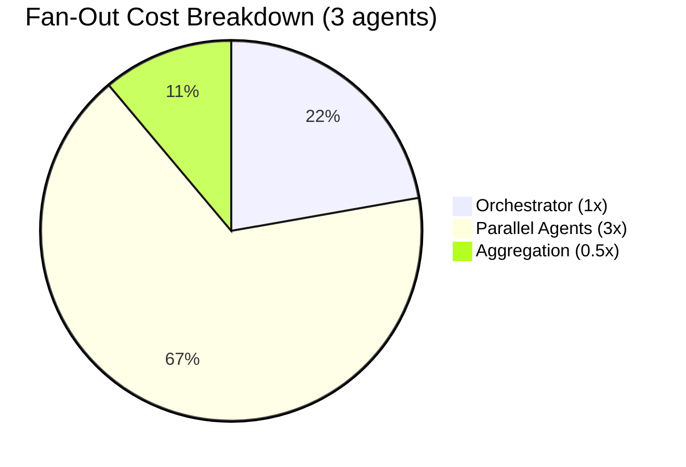
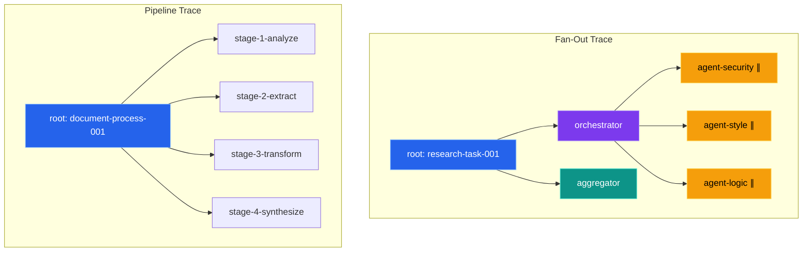
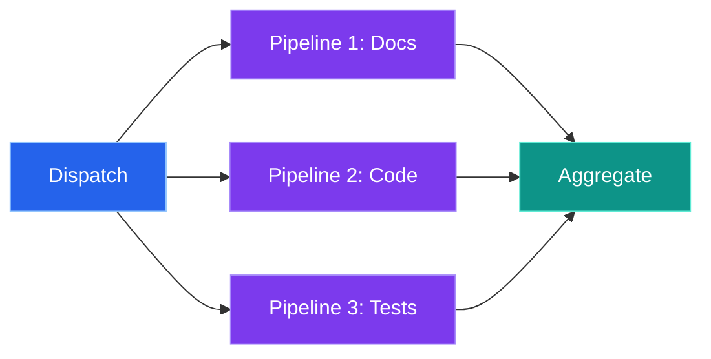
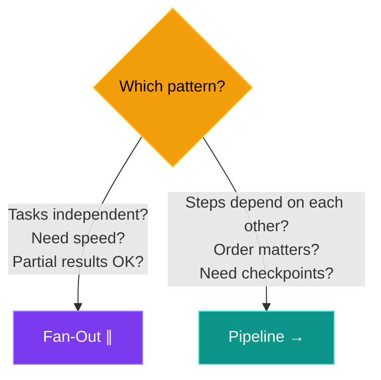

# Pattern Guide

SPINE has two main orchestration patterns:

| Pattern | How it runs | When to use |
|---------|-------------|-------------|
| **Fan-Out** | Parallel | Independent tasks that can run together |
| **Pipeline** | Sequential | Steps that depend on each other |

---

## Fan-Out (Parallel)

Run multiple tasks at once, then combine the results. Good when tasks don't depend on each other.

<div style="font-family: 'Inter', system-ui, sans-serif; max-width: 480px; margin: 1.5em auto; text-align: center;">
  <div style="background: #2563eb; color: #fff; font-weight: 600; padding: 10px 20px; border-radius: 8px; display: inline-block; box-shadow: 0 0 14px rgba(37,99,235,0.3);">Parent Envelope</div>
  <div style="color: #64748b; font-size: 18px; margin: 6px 0;">&#9663; &nbsp; &#9663; &nbsp; &#9663;</div>
  <div style="display: flex; gap: 12px; justify-content: center; margin-bottom: 6px;">
    <div style="background: #7c3aed; color: #fff; font-weight: 600; padding: 10px 16px; border-radius: 8px; font-size: 13px; box-shadow: 0 0 12px rgba(124,58,237,0.3);">Analyst A</div>
    <div style="background: #7c3aed; color: #fff; font-weight: 600; padding: 10px 16px; border-radius: 8px; font-size: 13px; box-shadow: 0 0 12px rgba(124,58,237,0.3);">Analyst B</div>
    <div style="background: #7c3aed; color: #fff; font-weight: 600; padding: 10px 16px; border-radius: 8px; font-size: 13px; box-shadow: 0 0 12px rgba(124,58,237,0.3);">Analyst C</div>
  </div>
  <div style="color: #64748b; font-size: 18px; margin: 6px 0;">&#9663; &nbsp; &#9663; &nbsp; &#9663;</div>
  <div style="background: #0d9488; color: #fff; font-weight: 600; padding: 10px 20px; border-radius: 8px; display: inline-block; box-shadow: 0 0 14px rgba(13,148,136,0.3);">Aggregate Results</div>
</div>

> **[Try the interactive Fan-Out Simulator →](../demos/fan-out-simulator/)**

### When to use it

| Scenario | Example |
|----------|---------|
| Multi-source research | Query multiple docs at once |
| Parallel analysis | Security, style, and logic review |
| Independent subtasks | Generate tests for multiple functions |
| Competitive evaluation | Compare approaches |

### Pseudo example

```
tasks = [
    { message: "Analyze source A", agent: "analyst-a" },
    { message: "Analyze source B", agent: "analyst-b" },
    { message: "Analyze source C", agent: "analyst-c" }
]

result = fan_out(parent_envelope, tasks, max_workers: 5)
```

### Cost



> Total: ~4.5x single-agent cost. Trade-off: more expensive, but faster wall-clock time.

---

## Pipeline (Sequential)

Process data through stages where each stage feeds the next. Good for transformations that build on each other.

<div style="font-family: 'Inter', system-ui, sans-serif; max-width: 660px; margin: 1.5em auto; display: flex; align-items: center; gap: 8px; justify-content: center; flex-wrap: wrap;">
  <div style="background: #2563eb; color: #fff; font-weight: 600; padding: 12px 16px; border-radius: 8px; text-align: center; font-size: 13px; box-shadow: 0 0 12px rgba(37,99,235,0.3);">Stage 1<br><span style="font-weight: 400; font-size: 11px; opacity: 0.8;">Analyze</span></div>
  <div style="color: #475569; font-size: 20px;">&#10140;</div>
  <div style="background: #7c3aed; color: #fff; font-weight: 600; padding: 12px 16px; border-radius: 8px; text-align: center; font-size: 13px; box-shadow: 0 0 12px rgba(124,58,237,0.3);">Stage 2<br><span style="font-weight: 400; font-size: 11px; opacity: 0.8;">Extract</span></div>
  <div style="color: #475569; font-size: 20px;">&#10140;</div>
  <div style="background: #0d9488; color: #fff; font-weight: 600; padding: 12px 16px; border-radius: 8px; text-align: center; font-size: 13px; box-shadow: 0 0 12px rgba(13,148,136,0.3);">Stage 3<br><span style="font-weight: 400; font-size: 11px; opacity: 0.8;">Transform</span></div>
  <div style="color: #475569; font-size: 20px;">&#10140;</div>
  <div style="background: #f59e0b; color: #000; font-weight: 600; padding: 12px 16px; border-radius: 8px; text-align: center; font-size: 13px; box-shadow: 0 0 12px rgba(245,158,11,0.3);">Stage 4<br><span style="font-weight: 400; font-size: 11px;">Synthesize</span></div>
</div>

> **[Try the interactive Pipeline Builder →](../demos/pipeline-builder/)**

### When to use it

| Scenario | Example |
|----------|---------|
| Document processing | Parse → Extract → Summarize |
| Data transformation | Fetch → Clean → Analyze → Report |
| Build processes | Lint → Test → Build → Deploy |
| Staged analysis | Explore → Plan → Implement → Verify |

### Pseudo example

```
steps = [
    { name: "analyze", prompt: "You are an analyst." },
    { name: "extract", prompt: "Extract key findings." },
    { name: "synthesize", transform: combine_results }
]

result = pipeline(parent_envelope, steps)
```

---

## ToolEnvelope

Both patterns wrap operations in a ToolEnvelope for traceability.

<div style="font-family: 'Inter', system-ui, sans-serif; max-width: 440px; margin: 1.5em auto; border-radius: 12px; overflow: hidden; box-shadow: 0 6px 24px rgba(0,0,0,0.15);">
  <div style="background: linear-gradient(135deg, #2563eb, #1d4ed8); padding: 12px 20px; color: #fff; font-weight: 700; font-size: 15px; letter-spacing: 0.5px;">ToolEnvelope</div>
  <div style="background: #1e293b; padding: 4px 0;">
    <div style="padding: 6px 20px; display: flex; gap: 10px; border-bottom: 1px solid #334155;">
      <span style="color: #60a5fa; font-size: 12px; font-weight: 600; min-width: 80px;">id</span>
      <code style="color: #e2e8f0; font-size: 12px;">call-abc123</code>
    </div>
    <div style="padding: 6px 20px; display: flex; gap: 10px; border-bottom: 1px solid #334155;">
      <span style="color: #60a5fa; font-size: 12px; font-weight: 600; min-width: 80px;">tool</span>
      <code style="color: #e2e8f0; font-size: 12px;">anthropic:claude-sonnet-4-5</code>
    </div>
    <div style="padding: 6px 20px; display: flex; gap: 10px; border-bottom: 1px solid #334155;">
      <span style="color: #a78bfa; font-size: 12px; font-weight: 600; min-width: 80px;">trace</span>
      <code style="color: #e2e8f0; font-size: 12px;">root: task-xyz &rarr; parent: orchestrator-001 &rarr; span: subagent-research</code>
    </div>
    <div style="padding: 6px 20px; display: flex; gap: 10px; border-bottom: 1px solid #334155;">
      <span style="color: #5eead4; font-size: 12px; font-weight: 600; min-width: 80px;">metadata</span>
      <code style="color: #e2e8f0; font-size: 12px;">tags: [research, phase-1] &bull; exp: exp-2025-001</code>
    </div>
    <div style="padding: 6px 20px; display: flex; gap: 10px; border-bottom: 1px solid #334155;">
      <span style="color: #fbbf24; font-size: 12px; font-weight: 600; min-width: 80px;">timing</span>
      <code style="color: #e2e8f0; font-size: 12px;">started_at / finished_at / duration_ms</code>
    </div>
    <div style="padding: 6px 20px; display: flex; gap: 10px;">
      <span style="color: #f472b6; font-size: 12px; font-weight: 600; min-width: 80px;">usage</span>
      <code style="color: #e2e8f0; font-size: 12px;">input_tokens / output_tokens</code>
    </div>
  </div>
</div>

### Trace examples

**Fan-out:**


---

## Combining Patterns

### Fan-out inside a pipeline

Run parallel tasks as one stage:

<div style="font-family: 'Inter', system-ui, sans-serif; max-width: 580px; margin: 1em auto; display: flex; align-items: center; gap: 8px; justify-content: center;">
  <div style="background: #2563eb; color: #fff; font-weight: 600; padding: 10px 14px; border-radius: 8px; font-size: 13px;">Prepare</div>
  <div style="color: #475569; font-size: 18px;">&#10140;</div>
  <div style="border: 2px dashed #475569; border-radius: 10px; padding: 10px 14px; display: flex; gap: 6px;">
    <div style="background: #f59e0b; color: #000; font-weight: 600; padding: 6px 12px; border-radius: 6px; font-size: 12px;">A</div>
    <div style="background: #f59e0b; color: #000; font-weight: 600; padding: 6px 12px; border-radius: 6px; font-size: 12px;">B</div>
    <div style="background: #f59e0b; color: #000; font-weight: 600; padding: 6px 12px; border-radius: 6px; font-size: 12px;">C</div>
  </div>
  <div style="color: #475569; font-size: 18px;">&#10140;</div>
  <div style="background: #0d9488; color: #fff; font-weight: 600; padding: 10px 14px; border-radius: 8px; font-size: 13px;">Synthesize</div>
</div>

### Pipelines inside fan-out

Run independent pipelines in parallel:



---

## Which Pattern?

| Factor | Fan-Out | Pipeline |
|--------|---------|----------|
| Task independence | High | Low |
| Order matters | No | Yes |
| Speed priority | Wall-clock time | Throughput |
| Error isolation | Good | Cascading risk |
| Debugging | Parallel traces | Linear flow |



---

## Logging

Everything logs to `./logs/YYYY-MM-DD/*.json`:
- Full envelope with trace hierarchy
- Token usage and cost estimates
- Timing
- Experiment IDs

---

## Tips

### Fan-out
1. Set reasonable max_workers
2. Handle partial failures
3. Don't go overboard on parallelism - cost adds up
4. Use meaningful component names for debugging

### Pipeline
1. Make stages idempotent for safe retries
2. Validate between stages
3. Log intermediate results
4. Use transform functions to shape data

### Both
1. Start simple
2. Watch costs
3. Always use ToolEnvelope
4. Test failure modes

---

## Related Docs

- [Architecture Overview](architecture.md) - system design and components
- [Tiered Enforcement Protocol](tiered-enforcement.md) - when to use each capability level

[← Back to Main](../README.md)
